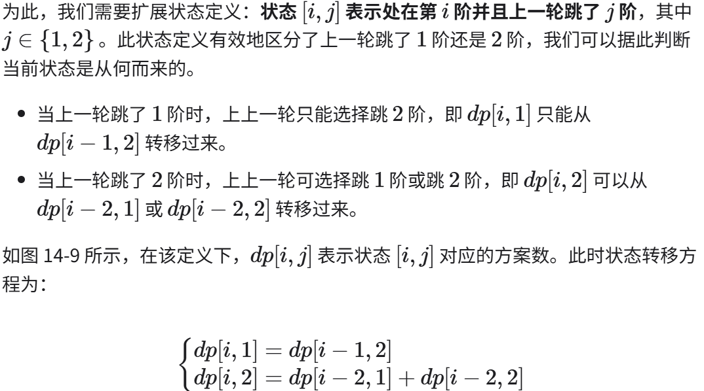

# 动态规划

## 关联：
1. 递归
2. DFS
3. DAG，与拓扑排序（线性dp）

## 知识点
1.前提：
- 动态规划问题的一般形式就是求**最值**
- 需要判断算法问题是否具备「**最优子结构**」，是否能够通过子问题的最值得到原问题的最值。
- 无后效性:其定义为：给定一个确定的状态，它的未来发展只与当前状态有关，而与过去经历的所有状态无关。
- 要符合**无后效性**：
  以爬楼梯问题为例，给定状态i，它会发展出状i+1和状态i+2，分别对应跳1步和跳2步。在做出这两种选择时，我们无须考虑状态i之前的状态，它们对状态i的未来没有影响。
  然而，如果我们给爬楼梯问题添加一个约束，情况就不一样了：给定一个共有n阶的楼梯，你每步可以上1阶或者2阶，但不能连续两轮跳1阶，请问有多少种方案可以爬到楼顶？
  这意味着，下一步选择不能由当前状态（当前所在楼梯阶数）独立决定，**还和前一个状态（上一轮所在楼梯阶数）有关**。
  
  ```py
  def climbing_stairs_constraint_dp(n: int) -> int:
    """带约束爬楼梯：动态规划"""
    if n == 1 or n == 2:
        return 1
    # 初始化 dp 表，用于存储子问题的解
    dp = [[0] * 3 for _ in range(n + 1)]
    # 初始状态：预设最小子问题的解
    dp[1][1], dp[1][2] = 1, 0
    dp[2][1], dp[2][2] = 0, 1
    # 状态转移：从较小子问题逐步求解较大子问题
    for i in range(3, n + 1):
        dp[i][1] = dp[i - 1][2]
        dp[i][2] = dp[i - 2][1] + dp[i - 2][2]
    return dp[n][1] + dp[n][2]
  ```
- 要符合**最优子结构**，子问题间必须互相独立。啥叫相互独立？你肯定不想看数学证明，我用一个直观的例子来讲解。

    （比如说，假设你考试，每门科目的成绩都是互相独立的。你的原问题是考出最高的总成绩，那么你的子问题就是要把语文考到最高，数学考到最高…… 为了每门课考到最高，你要把每门课相应的选择题分数拿到最高，填空题分数拿到最高…… 当然，最终就是你每门课都是满分，这就是最高的总成绩。

    得到了正确的结果：最高的总成绩就是总分。因为这个过程符合最优子结构，「每门科目考到最高」这些子问题是互相独立，互不干扰的。

    但是，如果加一个条件：你的语文成绩和数学成绩会互相制约，不能同时达到满分，数学分数高，语文分数就会降低，反之亦然。

    这样的话，显然你能考到的最高总成绩就达不到总分了，按刚才那个思路就会得到错误的结果。因为「每门科目考到最高」的子问题并不独立，语文数学成绩户互相影响，无法同时最优，所以最优子结构被破坏。）
2.核心：求解动态规划的核心问题是穷举，需要你熟练掌握递归思维，只有列出正确的「状态转移方程」，才能正确地穷举。
3.重叠子问题、最优子结构、状态转移方程就是动态规划三要素。
- 另外，动态规划问题存在**重叠子问题**，如果暴力穷举的话效率会很低，所以需要你使用「备忘录」或者「DP table」来优化穷举过程，避免不必要的计算。

## 例子
一、斐波那契数列
 ```py
    1.暴力递归
    def fib(N: int) -> int:
    if N == 1 or N == 2:
        return 1
    return fib(N - 1) + fib(N - 2)
    2.带备忘录的递归解法（自顶向下）
    耗时的原因是重复计算，那么我们可以造一个「备忘录」，每次算出某个子问题的答案后别急着返回，先记到「备忘录」里再返回；每次遇到一个子问题先去「备忘录」里查一查，如果发现之前已经解决过这个问题了，直接把答案拿出来用，不要再耗时去计算了。
    def fib(N: int) -> int:
        # 备忘录全初始化为 0
        memo = [0] * (N + 1)
        # 进行带备忘录的递归
        return dp(memo, N)

    #带着备忘录进行递归
    def dp(memo: List[int], n: int) -> int:
        # base case
        if n == 0 or n == 1: return n
        # 已经计算过，不用再计算了
        if memo[n] != 0: return memo[n]
        memo[n] = dp(memo, n - 1) + dp(memo, n - 2)
        return memo[n]
```
3.dp数组的迭代解法（自底向上）
有了上一步「备忘录」的启发，我们可以把这个「备忘录」独立出来成为一张表，通常叫做 DP table，在这张表上完成「自底向上」的推算岂不美哉！
```py
def fib(N: int) -> int:
    if N == 0:
        return 0
    dp = [0] * (N + 1)
    # base case
    dp[0] = 0
    dp[1] = 1
    # 状态转移
    for i in range(2, N + 1):
        dp[i] = dp[i - 1] + dp[i - 2]

    return dp[N]
```
### 扩展：
「状态转移方程」这个名词，实际上就是描述问题结构的数学形式：
**f(n)=1 n= 1,2
f(n)=f(n - 1) + f(n - 2) n>= 3**

为啥叫「状态转移方程」？其实就是为了听起来高端。

f(n) 的函数参数会不断变化，所以你把参数 n 想做一个状态，这个状态 n 是由状态 n - 1 和状态 n - 2 转移（相加）而来，这就叫状态转移，仅此而已。

你会发现，上面的几种解法中的所有操作，例如 return f(n - 1) + f(n - 2)，dp[i] = dp[i - 1] + dp[i - 2]，以及对备忘录或 DP table 的初始化操作，都是围绕这个方程式的不同表现形式。

可见列出「状态转移方程」的重要性，它是解决问题的核心，而且很容易发现，其实状态转移方程直接代表着暴力解法。动态规划问题最困难的就是写出这个暴力解，即状态转移方程。

只要写出暴力解，优化方法无非是用备忘录或者 DP table，再无奥妙可言。

### 优化空间复杂度
当前状态 n 只和之前的 n-1, n-2 两个状态有关，其实并不需要那么长的一个 DP table 来存储所有的状态，只要想办法存储之前的两个状态就行了。
```py
def fib(n: int) -> int:
    if n == 0 or n == 1:
        # base case
        return n
    # 分别代表 dp[i - 1] 和 dp[i - 2]
    dp_i_1, dp_i_2 = 1, 0
    for i in range(2, n + 1):
        # dp[i] = dp[i - 1] + dp[i - 2];
        dp_i = dp_i_1 + dp_i_2
        # 滚动更新
        dp_i_2 = dp_i_1
        dp_i_1 = dp_i
    return dp_i_1
```
## 总结：
1.
    - 状态转移方程是解决问题的核心
    - 动态规划的设计方法：
        - 暴力递归
        - 带备忘录的递归（自顶向下）
        - 迭代的动态规划（自底向上）
        - 优化空间复杂度，可能只与前几个状态有关

2.实操：
    明确「状态」-> 明确「选择」 -> 定义 dp 数组/函数的含义。
```py
    #自顶向下递归的动态规划
    def dp(状态1, 状态2, ...):
        for 选择 in 所有可能的选择:
            # 此时的状态已经因为做了选择而改变
            result = 求最值(result, dp(状态1, 状态2, ...))
        return result

    #自底向上迭代的动态规划
    #初始化 base case
    dp[0][0][...] = base case
    #进行状态转移
    for 状态1 in 状态1的所有取值：
        for 状态2 in 状态2的所有取值：
            for ...
                dp[状态1][状态2][...] = 求最值(选择1，选择2...)
```
### 例子
力扣第 322 题「零钱兑换」：

给你 k 种面值的硬币，面值分别为 c1, c2 ... ck，每种硬币的数量无限，再给一个总金额 amount，问你最少需要几枚硬币凑出这个金额，如果不可能凑出，算法返回 -1 。
- 前提：
    - 为什么说它符合最优子结构呢？假设你有面值为 1, 2, 5 的硬币，你想求 amount = 11 时的最少硬币数（原问题），如果你知道凑出 amount = 10, 9, 6 的最少硬币数（子问题），你只需要把子问题的答案加一（再选一枚面值为 1, 2, 5 的硬币），求个最小值，就是原问题的答案。因为硬币的数量是没有限制的，所以子问题之间没有限制，是互相独立的。

- 如何列出正确的**状态转移方程**？


    1、确定「状态」，也就是原问题和子问题中会变化的变量。由于硬币数量无限，硬币的面额也是题目给定的，只有目标金额会不断地向 base case 靠近，所以唯一的「状态」就是目标金额 amount。

    2、确定「选择」，也就是导致「状态」产生变化的行为。目标金额为什么变化呢，因为你在选择硬币，你每选择一枚硬币，就相当于减少了目标金额。所以说所有硬币的面值，就是你的「选择」。

    3、明确 dp 函数/数组的定义。我们这里讲的是自顶向下的解法，所以会有一个递归的 dp 函数，一般来说函数的参数就是状态转移中会变化的量，也就是上面说到的「状态」；函数的返回值就是题目要求我们计算的量。就本题来说，状态只有一个，即「目标金额」，题目要求我们计算凑出目标金额所需的最少硬币数量。

    所以我们可以这样定义 dp 函数：dp(n) 表示，输入一个目标金额 n，返回凑出目标金额 n 所需的最少硬币数量。那么根据这个定义，我们的最终答案就是 dp(amount) 的返回值。

#### 答案：
```py
1.
class Solution:
    def coinChange(self, coins: List[int], amount: int) -> int:
        # 题目要求的最终结果是 dp(amount)
        return self.dp(coins, amount)

    # 定义：要凑出金额 n，至少要 dp(coins, n) 个硬币
    def dp(self, coins, amount):
        # base case
        if amount == 0: 
            return 0
        if amount < 0: 
            return -1

        res = float('inf')
        for coin in coins:
            # 计算子问题的结果
            subProblem = self.dp(coins, amount - coin)
            # 子问题无解则跳过
            if subProblem == -1: 
                continue
            # 在子问题中选择最优解，然后加一
            res = min(res, subProblem + 1)

        return res if res != float('inf') else -1
```
```py
2.带备忘录的递归
class Solution:
    def __init__(self):
        self.memo = []
    
    def coinChange(self, coins: List[int], amount: int) -> int:
        self.memo = [-666] * (amount + 1)
        # 备忘录初始化为一个不会被取到的特殊值，代表还未被计算
        return self.dp(coins, amount)
    
    def dp(self, coins, amount):
        if amount == 0: return 0
        if amount < 0: return -1
        # 查备忘录，防止重复计算
        if self.memo[amount] != -666:
            return self.memo[amount]

        res = float('inf')
        for coin in coins:
            # 计算子问题的结果
            subProblem = self.dp(coins, amount - coin) 
            # 子问题无解则跳过
            if subProblem == -1: continue
            # 在子问题中选择最优解，然后加一
            res = min(res, subProblem + 1)
        # 把计算结果存入备忘录
        self.memo[amount] = res if res != float('inf') else -1
        return self.memo[amount]
```
```py
3.dp 数组的迭代解法
class Solution:
    def coinChange(self, coins: List[int], amount: int) -> int:
        # 数组大小为 amount + 1，初始值也为 amount + 1
        dp = [amount + 1] * (amount + 1)

        dp[0] = 0
        # base case
        # 外层 for 循环在遍历所有状态的所有取值
        for i in range(len(dp)):
            # 内层 for 循环在求所有选择的最小值
            for coin in coins:
                # 子问题无解，跳过
                if i - coin < 0:
                    continue
                dp[i] = min(dp[i], 1 + dp[i - coin]) 
        return -1 if dp[amount] == amount + 1 else dp[amount]
```