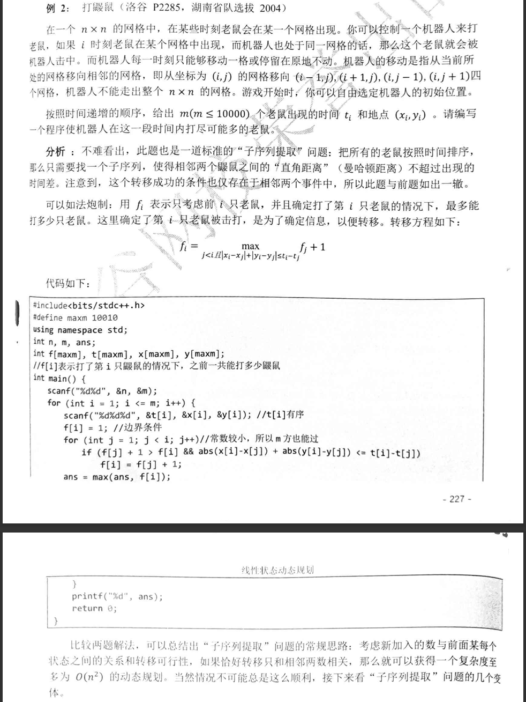
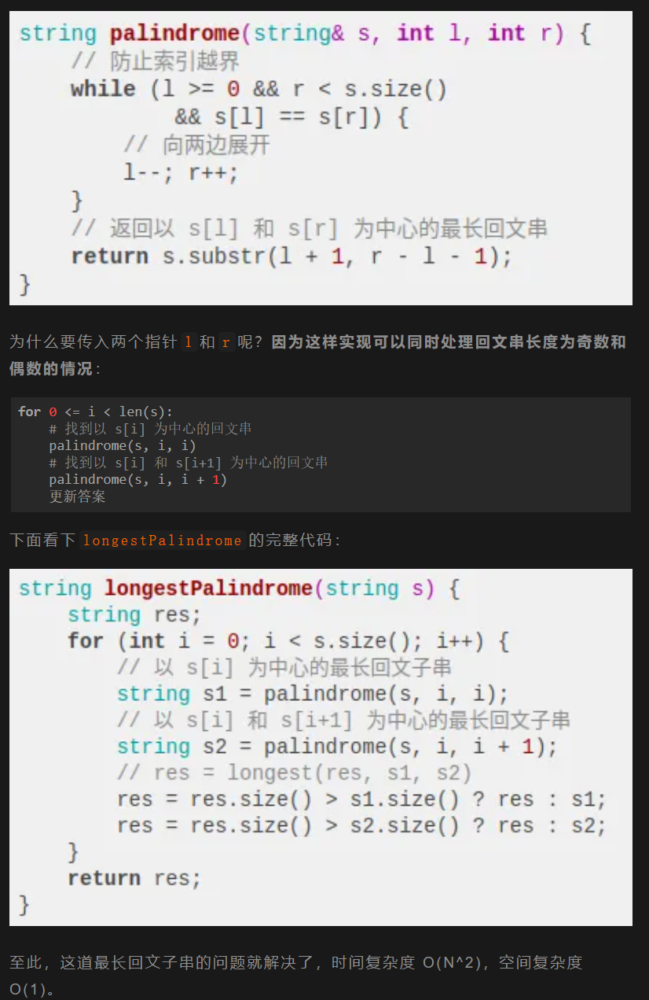
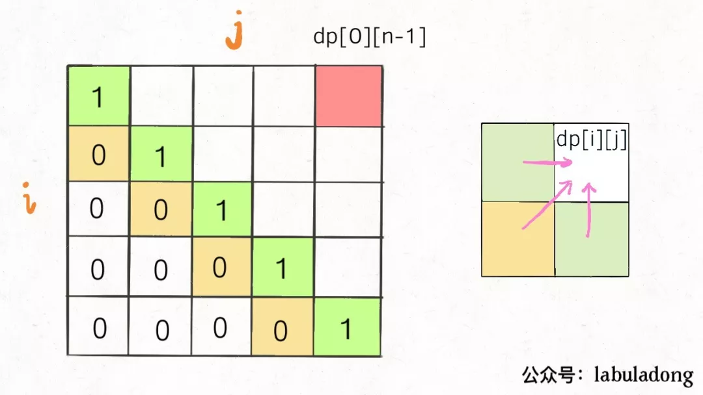
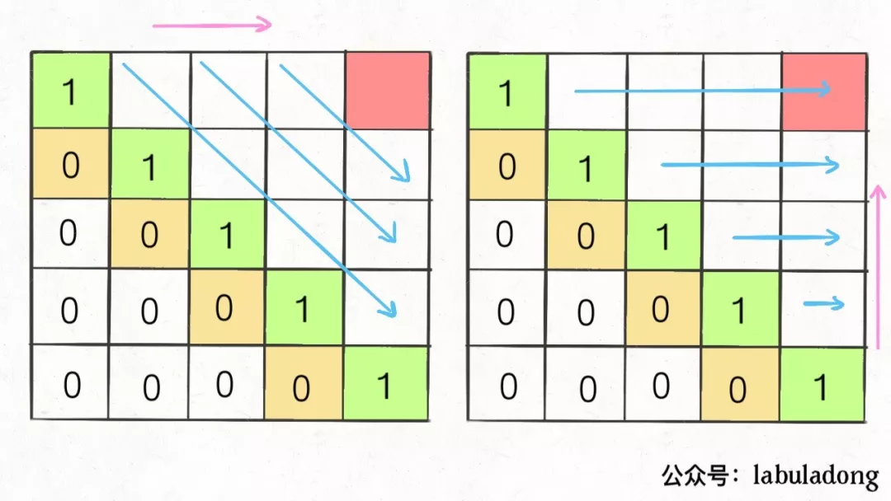

## 子串问题：
### 最长公共子串：
1. dp：
- **注意与最长公共子序列对比**
```py
 dp = [[0 for _ in range(m + 1)] for _ in range(m + 1)]
    ans = 0
    for i in range(1,m + 1):
        for j in range(1,m + 1):
            dp[i][j] = dp[i - 1][j - 1] + 1 if s[x][i - 1] == s[y][j - 1] else 0
            ans = max(ans, dp[i][j])
```
- 时间复杂度：O(n^2)
2. 字符串滚动哈希+二分：
~~~py
def rabin_karp_hash(s, length):
        if length == 0:
            return set()
        base, mod = 31, 2**61 - 1
        hash_set = set()
        hash_value = 0
        power = 1  
        for i in range(length):
            hash_value = (hash_value * base + ord(s[i])) % mod
            power = (power * base) % mod
        hash_set.add(hash_value)
        for i in range(length, len(s)):
            hash_value = (hash_value * base - ord(s[i - length]) * power + ord(s[i])) % mod
            hash_set.add(hash_value)
        return hash_set

def getLongest(s1, s2):
    n=len(s1)
    left, right = 0, min(len(s1), len(s2))
    while left < right:
        mid = (left + right + 1) // 2
        if rabin_karp_hash(s1, mid) & rabin_karp_hash(s2, mid): 
            left = mid  
        else:
            right = mid - 1  
    return min(left,n//2)#考虑字符串可以移动，所以读取时×2，结果要除以2
~~~
- 时间复杂度：O(nlogn)
## 子序列问题：
这类问题都是让你求一个最长子序列，因为最短子序列就是一个字符嘛，没啥可问的。一旦涉及到子序列和最值，那几乎可以肯定，考察的是动态规划技巧，时间复杂度一般都是 O(n^2)。

原因很简单，你想想一个字符串，它的子序列有多少种可能？起码是指数级的吧，这种情况下，不用动态规划技巧，还想怎么着呢？

1. 第一种思路模板是一个一维的 dp 数组：
```c
int n = array.length;
int[] dp = new int[n];

for (int i = 1; i < n; i++) {
    for (int j = 0; j < i; j++) {
        dp[i] = 最值(dp[i], dp[j] + ...)
    }
}
```
举个我们写过的例子 最长递增子序列，在这个思路中 dp 数组的定义是：

在子数组array[0..i]中，以array[i]结尾的目标子序列（最长递增子序列）的长度是dp[i]。

为啥最长递增子序列需要这种思路呢？前文说得很清楚了，因为这样符合归纳法，可以找到状态转移的关系，这里就不具体展开了。

2. 第二种思路模板是一个二维的 dp 数组：
```c
int n = arr.length;
int[][] dp = new dp[n][n];

for (int i = 0; i < n; i++) {
    for (int j = 1; j < n; j++) {
        if (arr[i] == arr[j]) 
            dp[i][j] = dp[i][j] + ...
        else
            dp[i][j] = 最值(...)
    }
}
```
这种思路运用相对更多一些，尤其是**涉及两个字符串/数组的子序列**。本思路中 dp 数组含义又分为「只涉及一个字符串」和「涉及两个字符串」两种情况。

  1.  涉及两个字符串/数组时（比如最长公共子序列），dp 数组的含义如下：

在子数组arr1[0..i]和子数组arr2[0..j]中，我们要求的子序列（最长公共子序列）长度为dp[i][j]。

  2. 只涉及一个字符串/数组时（比如本文要讲的最长回文子序列），dp 数组的含义如下：

在子数组array[i..j]中，我们要求的子序列（最长回文子序列）的长度为dp[i][j]。


### LCS
如果s1[i]==s2[j]，那么这个字符⼀定在lcs中否则的话，s1[i]和s2[j],这两个字⾄少有⼀个不在lcs中
```py
def	longestCommonSubsequence(str1,	str2)->	int:
  def  dp(i,j):
    #空串的base case
    if i==-1 or j==-1:
        return 0
    if str1[i] == str2[j]:
    #这边找到⼀个lcs的元素，继续往前找
        return dp(i-1,j-1)+1
    else:
    #谁能让	lcs	最⻓，就听谁的
        return max(dp(i-1,j),dp(i,j-1))
    #i和j初始化为最后⼀个索引
    return dp(len(str1)-1,len(str2)-1)
```
### 最大编辑距离
- 思路：
~~~plaintext
if s1[i] == s2[j]:
    啥都别做（skip）
    i, j 同时向前移动
else:
    三选一：
        插入（insert）
        删除（delete）
        替换（replace）
~~~
- 代码：
~~~py
def minDistance(s1, s2) -> int:
    def dp(i, j):
        # base case
        if i == -1: return j + 1
        if j == -1: return i + 1

        if s1[i] == s2[j]:
            return dp(i - 1, j - 1)  # 啥都不做
        else:
            return min(
                dp(i, j - 1) + 1,  # 插入
                dp(i - 1, j) + 1,  # 删除
                dp(i - 1, j - 1) + 1  # 替换
            )

    # i，j 初始化指向最后⼀个索引
    return dp(len(s1) - 1, len(s2) - 1)
  # if s1[i] == s2[j]:
      #return dp(i - 1, j - 1)  # 啥都不做
  # 解释：
  # 本来就相等，不需要任何操作
  # s1[0..i] 和 s2[0..j] 的最小编辑距离等于
  # s1[0..i-1] 和 s2[0..j-1] 的最小编辑距离
  # 也就是说 dp(i, j) 等于 dp(i-1, j-1)

  #dp(i, j - 1) + 1,    # 插入
  # 解释：
  # 我直接在 s1[i] 插入一个和 s2[j] 一样的字符
  # 那么 s2[j] 就被匹配了，前移 j，继续跟 i 对比
  # 别忘了操作数加

  #dp(i - 1, j) + 1,    # 删除
  # 解释：
  # 我直接把 s[i] 这个字符删掉
  # 前移 i，继续跟 j 对比
  # 操作数加一

  #dp(i - 1, j - 1) + 1 # 替换
  # 解释：
  # 我直接把 s1[i] 替换成 s2[j]，这样它俩就匹配了
  # 同时前移 i，j 继续对比
  # 操作数加一
~~~
- 动图详见[labuladong](https://mp.weixin.qq.com/s/uWzSvWWI-bWAV3UANBtyOw)
### LIS
1. 模板：
   1. 动态规划：
   ```py
   n=int(input())
   s=[int(i) for i in input().split()]
   dp=[1]*n

   #dp[i]=
   for i in range(n):
       for j in range(i):
           if s[j]<s[i]:
               dp[i]=max(dp[i],dp[j]+1)

   dp.sort()
   print(dp[n-1])
   ```
   2. 贪心二分：
   ```py
   import bisect

   n = int(input())
   s = list(map(int, input().split()))

   tail = []
   for num in s:
       idx = bisect.bisect_left(tail, num)
       if idx == len(tail):
           tail.append(num)
       else:
           tail[idx] = num

   print(len(tail))
   ```
2. eg:

 - **为什么要f[j]>f[i]+1**:
    在动态规划过程中，`f[j] + 1 > f[i]` 的条件用于确保每次转移都选择最优解。具体原因如下：

    1. **状态定义**：`f[i]` 表示在必须打第 `i` 只鼹鼠时，前 `i` 只中最多能打的数量。初始时，`f[i] = 1`（只打第 `i` 只）。

    2. **转移逻辑**：当从 `j` 转移到 `i` 时，总数量为 `f[j] + 1`（即打 `j` 的最优解 + 打 `i` 自身）。需要比较 `f[j] + 1` 和当前 `f[i]` 的值：
    - 若 `f[j] + 1 > f[i]`，说明通过 `j` 转移到 `i` 更优，更新 `f[i]`；
    - 否则保留当前更优解。

    1. **保证最大值**：可能有多个 `j` 满足转移条件（时间差足够移动），但需要选择其中最大的 `f[j] + 1`。条件判断确保每次只接受更优的转移，避免被较小的值覆盖。

    **总结**：该条件是为了在遍历所有可能的 `j` 时，动态更新 `f[i]` 为最大值，保证动态规划的正确性。
## 回文

### 回文子串
1. 思路：
寻找回文串的问题核心思想是：从中间开始向两边扩散来判断回文串。回文串的长度可能是奇数也可能是偶数，所以代码：
```py
for 0 <= i < len(s):
    找到以 s[i] 为中心的回文串
    找到以 s[i] 和 s[i+1] 为中心的回文串
    更新答案
```
2. 代码：

### 回文子序列
1. 思路：
     1. 对 dp 数组的定义是：在子串s[i..j]中，最长回文子序列的长度为dp[i][j]。
   这取决于s[i]和s[j]的字符：
   如果它俩相等，那么它俩加上s[i+1..j-1]中的最长回文子序列就是s[i..j]的最长回文子序列
   如果它俩不相等，说明它俩不可能同时出现在s[i..j]的最长回文子序列中，那么把它俩分别加入s[i+1..j-1]中，看看哪个子串产生的回文子序列更长即可：
   ```c
   if (s[i] == s[j])
       // 它俩一定在最长回文子序列中
       dp[i][j] = dp[i + 1][j - 1] + 2;
   else
       // s[i+1..j] 和 s[i..j-1] 谁的回文子序列更长？
       dp[i][j] = max(dp[i + 1][j], dp[i][j - 1]);
   ```
     2. 明确一下 base case，如果只有一个字符，显然最长回文子序列长度是 1，也就是dp[i][j] = 1,(i == j)。

      因为i肯定小于等于j，所以对于那些i > j的位置，根本不存在什么子序列，应该初始化为 0。

      另外，看看刚才写的状态转移方程，想求dp[i][j]需要知道dp[i+1][j-1]，dp[i+1][j]，dp[i][j-1]这三个位置；再看看我们确定的 base case，填入 dp 数组之后是这样：
      

     3. 遍历方向：为了保证每次计算dp[i][j]，左下右方向的位置已经被计算出来，只能斜着遍历或者反着遍历：
     
     反着遍历，代码如下：
      ```c
        int longestPalindromeSubseq(string s) {
       int n = s.size();
       // dp 数组全部初始化为 0
       vector<vector<int>> dp(n, vector<int>(n, 0));
       // base case
       for (int i = 0; i < n; i++)
           dp[i][i] = 1;
       // 反着遍历保证正确的状态转移
       for (int i = n - 1; i >= 0; i--) {
           for (int j = i + 1; j < n; j++) {
               // 状态转移方程
               if (s[i] == s[j])
                   dp[i][j] = dp[i + 1][j - 1] + 2;
               else
                   dp[i][j] = max(dp[i + 1][j], dp[i][j - 1]);
           }
       }
       // 整个 s 的最长回文子串长度
       return dp[0][n - 1];
      }
      ```