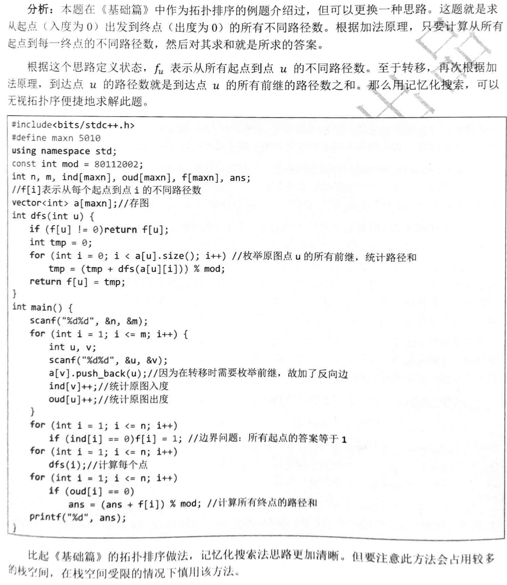

# DAG
1. DAG：有向无环图
2. 代码模板：
```py
# 本质动态规划
 #g[]为邻接表
def dfs(x):
    if vis[x]:
        return vis[x]
    
    for i in range(len(g[x])):
        vis[x]=max(vis[x],dfs(g[x][i]))
    vis[x]+=t[x]
    return vis[x]

```
# 拓扑排序
1. 目的：确保从必须先完成的任务开始
2. 代码模板：
   1. BFS
   ```py
   #BFS 入度为0即做完，可以push入队列
   in_d=[0] for i in range(n+1)
    #统计食物链最末尾的点
   out_d=[0] for i in range(n+1)
   q=[]
    #g[]为邻接表
   s=[0]*(n+1) #ans

   #统计出入度
   for i in range(m):
       #x:被捕食 y:捕食者
       x,y=map(int,input().split())
       in_d[y]+=1
       out_d[x]+=1

   #处理点，入度为一优先进入队列：
   for i in range(1,n+1):
       if in_d[i]==0:
           q.push[i]
           s[i]=1
   while q:
       x=q.pop()
       for i in range(len(g[x])):
           y=g[x][i]
           in_d[y]-=1
           s[y]=s[y]+s[x]#到y的路径数量等于到前一个点x的累加
           #BFS 入度为0，push
           if in_d[y]==0:
               q.push(y)

   ```
   2. dp
   
   - 缺点：栈空间较大