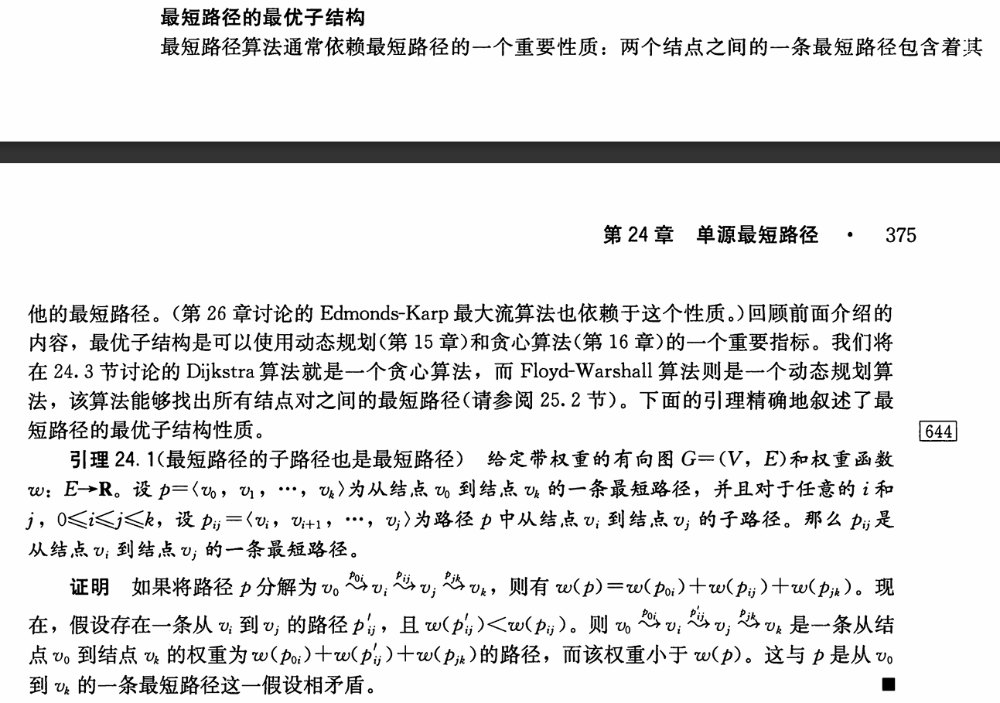

# Dijstra
- 本质**贪心**
```py
import heapq

def dijkstra(graph, start):
    """
    使用优先队列实现的Dijkstra算法
    :param graph: 图的邻接表表示，格式为字典，graph[u] = [(v1, w1), (v2, w2), ...]
    :param start: 源点
    :return: 最短距离字典（若存在不可达节点，值为inf）
    """
    # 初始化距离字典，所有节点距离为无穷大
    distance = {node: float('inf') for node in graph}
    distance[start] = 0  # 源点到自身的距离为0

    # 优先队列：存储 (当前距离, 节点)，初始为源点
    priority_queue = []
    heapq.heappush(priority_queue, (0, start))

    # 记录已确定最短路径的节点（Dijkstra的贪心特性）
    visited = set()
# **BFS**
    while priority_queue:
        # 弹出当前距离最小的节点
        current_dist, u = heapq.heappop(priority_queue)
        # 若该节点已处理过，跳过（避免重复计算）
        if u in visited:
            continue
        visited.add(u)

        # **贪心**
        # 遍历u的所有邻接节点
        for v, w in graph[u]:
            # 若通过u到v的路径更短，则更新距离并加入队列
            if distance[v] > current_dist + w:
                distance[v] = current_dist + w
                heapq.heappush(priority_queue, (distance[v], v))

    return distance
```
- 算法复杂度：
	- 时间复杂度：O(ElogV)
	- 空间复杂度：O(V)

# Bellman-ford
- 本质**dp**
```py
def bellman_ford(edges, start, num_nodes):
    # base case
    distance = [float('inf')] * num_nodes
    distance[start] = 0
    # dp结束条件：遍历次数n=num_nodes - 1
    for _ in range(num_nodes - 1):
        # 遍历所有边，dp
        for u, v, w in edges:
            if distance[u] + w < distance[v]:
                distance[v] = distance[u] + w
    # 检测负权环
    for u, v, w in edges:
        if distance[u] + w < distance[v]:
            return None  # 存在负权环
    return distance
```
- 算法复杂度：
	- 时间复杂度：O(VE)
	- 空间复杂度：O(V)

# SPFA
### SPFA算法详解

#### 算法背景
- SPFA（Shortest Path Faster Algorithm）是Bellman-Ford算法的队列优化版本，
- 用于求解**带负权边**的图单源最短路径问题。
- 相比Bellman-Ford的O(VE)时间复杂度，SPFA在平均情况下可达O(E)，效率更高。

#### 与Bellman-Ford的关系
- **Bellman-Ford核心思想**：对图中所有边进行V-1轮松弛操作，确保找到最短路径。
- **SPFA优化点**：通过队列仅对“可能松弛成功”的节点进行松弛，避免无效操作。
- **共同点**：都能检测负权环；时间复杂度最坏情况下均为O(VE)。


### Python代码模板

```python
from collections import deque
"""
算法流程
1. 初始化距离数组`dist[]`，源点距离为0，其余为无穷大。
2. 使用队列存储待松弛节点，源点入队。
3. 取出队首节点`u`，遍历其邻接边`u→v`，若`dist[v] > dist[u] + w`：
   - 更新`dist[v]`
   - 若`v`不在队列中，则入队
4. 重复步骤3直到队列空。
5. 检测负环：若某节点入队次数≥V次，则存在负环。
"""
def spfa(n, graph, start):
    # 初始化距离数组和入队标记
    dist = [float('inf')] * n
    dist[start] = 0
    in_queue = [False] * n
    queue = deque([start])
    in_queue[start] = True
    cnt = [0] * n  # 记录入队次数
    
    while queue:
        u = queue.popleft()
        in_queue[u] = False
        for v, w in graph[u]:
            if dist[v] > dist[u] + w:
                dist[v] = dist[u] + w
                # 更新，使松弛成功的节点进行松弛
                if not in_queue[v]:
                    queue.append(v)
                    in_queue[v] = True
                    cnt[v] += 1
                    # 检测负环，若有负环，一直进入队列，直到cnt[v] >= n
                    if cnt[v] >= n:
                        return "存在负权环!"
    return dist

# 示例图构建（邻接表）
n = 4
graph = [
    [(1,4), (2,5)],    # 0的邻接边
    [(2,-2), (3,1)],    # 1的邻接边
    [(3,3)],            # 2的邻接边
    []                  # 3的邻接边
]
"""
执行过程：
1. 初始队列`[0]`，`dist[0]=0`
2. 处理节点0，更新1(4)、2(5)，队列变为`[1,2]`
3. 处理节点1，更新2(4+(-2)=2)、3(4+1=5)，队列变为`[2,3]`
4. 处理节点2，尝试更新3(2+3=5，无变化)，队列变为`[3]`
5. 处理节点3，无邻接边，队列空。最终最短路径为`[0,4,2,5]`
"""
"""
图结构（节点0为源点）：
0--4-->1
|     ↓  \1
5    ↓-2 ↘
↓    2--3-->3
2       
"""
print(spfa(n, graph, 0))  # 输出 [0,4,2,5]
```


### 关键点总结
1. **队列优化**：仅松弛被更新的节点，避免Bellman-Ford的盲目松弛。
2. **负环检测**：通过节点入队次数判断（≥V次则存在负环）。
3. **性能对比**：稀疏图中SPFA优势明显，稠密图可能退化到O(VE)。
4. **应用场景**：含负权边的最短路径问题（如费用流中的最短路增广）。

---
# 证明
### 最优子结构

1. Dijstra算法是一种贪心算法，它的贪心策略是：每次选择距离起点最近的点，然后更新它的邻居的距离。
2. Bellman-ford算法是一种动态规划算法，它的动态规划策略是：对所有点进行松弛操作，每次松弛操作都更新所有点的距离。

---
### Dijstra
证明见《*蓝桥杯算法入门*》证明

---
### Bellman
证明 **Bellman-Ford 算法经过 \(n-1\) 次松弛操作后能得到最短路径**。


##### **1. 基本概念回顾**
- **问题**：在带权有向图中，求从源点 \(s\) 到所有其他顶点的最短路径。允许边权为负数，但**不能有负权环**（否则最短路径可能不存在）。
- **松弛操作（Relaxation）**：  
  对边 \(u \to v\)（权值 \(w(u,v)\)），若发现 \(s \to u \to v\) 的路径比当前已知的 \(s \to v\) 的路径更短，则更新 \(v\) 的最短距离：    `
  \[
  d[v] = \min(d[v], d[u] + w(u,v))
  \]


##### **2. 证明思路**
1. **关键观察：最短路径的最多边数**
- 在 \(n\) 个顶点的图中，**任何简单路径（无重复顶点）的边数最多为 \(n-1\)**。  
  - 例如：路径 \(s \to a \to b \to c\) 有 3 条边，对应 4 个顶点。
- 如果路径边数超过 \(n-1\)，则路径中必然存在环。由于假设无负权环，环的权值和非负，绕环不会使路径更短，因此**有意义的最短路径均为简单路径**。

2. **数学归纳法**
**归纳目标**：  
第 \(k\) 轮松弛操作后，所有通过**最多 \(k\) 条边**的最短路径已被正确计算。

##### **证明过程**：
- **基例（\(k=0\)）**：  
  初始时，源点 \(s\) 的距离为 0，其他顶点距离为 \(\infty\)。此时“最多 0 条边”的路径只有源点本身，已正确计算。

- **归纳假设**：  
  假设第 \(k\) 轮松弛后，所有通过最多 \(k\) 条边的最短路径已被正确计算。

- **归纳步骤（证明第 \(k+1\) 轮后结论成立）**：  
  考虑任意一条通过最多 \(k+1\) 条边的最短路径 \(P = s \to v_1 \to v_2 \to \dots \to v_{k+1}\)。  
  - 根据路径的最优性，路径 \(P\) 的子路径 \(s \to v_1 \to \dots \to v_k\) 必然是最短路径（否则 \(P\) 本身不是最短路径）。  
  - 由归纳假设，子路径的最短距离在第 \(k\) 轮后已正确计算。  
  - 在第 \(k+1\) 轮中，算法会处理边 \(v_k \to v_{k+1}\)，此时松弛操作会更新 \(v_{k+1}\) 的距离，使其等于 \(d[v_k] + w(v_k, v_{k+1})\)，即正确的最短距离。**(因为\(d[v_k] + w(v_k, v_{k+1})\)最小，则\(d[v_k]\)min，\(w(v_k, v_{k+1})\)min，\(d[v_k]\)已经最小，在这一步中遍历所有边，使\(w(v_k, v_{k+1})\)min)**

- **结论**：  
  经过 \(n-1\) 轮松弛后，所有最多 \(n-1\) 条边的最短路径已被计算。由于所有有意义的最短路径边数不超过 \(n-1\)，因此算法正确。


##### **负权环的检测**
- 如果图中存在负权环，则在第 \(n\) 轮松弛时，仍会有顶点的距离被更新。  
- 因此，Bellman-Ford 在第 \(n\) 轮增加一次检查：若发现距离仍可更新，则说明存在负权环。

---

###### **总结**
通过数学归纳法和对路径边数的分析，我们证明了：  
- 在无负权环的图中，经过 \(n-1\) 轮松弛后，所有顶点的最短距离已被正确计算。  
- 若存在负权环，算法会在第 \(n\) 轮检测到。  


---
## bellan 与 dijstra：
### **二者不同**：
1. Dijstra算法不能处理负权边，而Bellman-ford可以。**why**
2. Dijstra算法使用了贪心策略，而Bellman-ford使用了动态规划。
3. Dijstra算法优化了bellman，只对最短的点的邻居松弛，而Bellman-ford对所有点松弛

### **二者关系**：
Dijkstra 算法确实是 **Bellman-Ford 算法在特定场景下的改进**，其核心思想是通过**贪心策略选择当前已知最短的顶点**进行松弛，从而大幅减少计算量。以下是两者的对比及改进原理：

**1. Bellman-Ford 算法的基本流程**
- **核心操作**：对图中所有边进行 \(V-1\) 轮松弛（\(V\) 为顶点数）。
- **时间复杂度**：\(O(VE)\)，适用于**含负权边**的图，并能检测负权环。
- **问题**：每一轮都要遍历所有边，存在大量冗余计算。

**2. Dijkstra 算法的改进**
  1.  **贪心策略：选择当前最短路径的顶点**
  - **优先级队列（堆）**：维护一个优先队列，每次选择**距离起点最近的顶点**进行松弛。
  - **关键优化**：一旦某个顶点的最短路径被确定，后续不再重复处理，避免了冗余操作。
  - **时间复杂度**：使用优先队列优化后为 \(O((V+E)\log V)\)，在**无负权边**的图中效率远高于 Bellman-Ford。

  2.  **为什么能减少时间复杂度？**
  - **剪枝冗余松弛**：通过优先队列，每次只对“最有希望缩短路径”的顶点进行松弛，避免了对所有边的盲目遍历。
  - **确定性最短路径**：在无负权边的图中，已确定最短路径的顶点不会被后续更新，因此无需重复处理。

**3. 改进的代价：Dijkstra 的局限性**
- **无法处理负权边**  
  如果图中存在负权边，已确定最短路径的顶点可能通过**负权边绕道**得到更短路径，但 Dijkstra 无法重新处理这些顶点，导致结果错误。
  
  **示例**：
  - 顶点 \(A \to B\) 的边权为 \(2\)，\(A \to C \to B\) 的路径总权为 \(1 + (-2) = -1\)。  
  - Dijkstra 会先确定 \(B\) 的最短路径为 \(2\)，但实际最短路径是 \(-1\)，导致错误。

- **无法检测负权环**  
  Bellman-Ford 可以通过第 \(V\) 轮松弛检测负权环，而 Dijkstra 无法做到。

