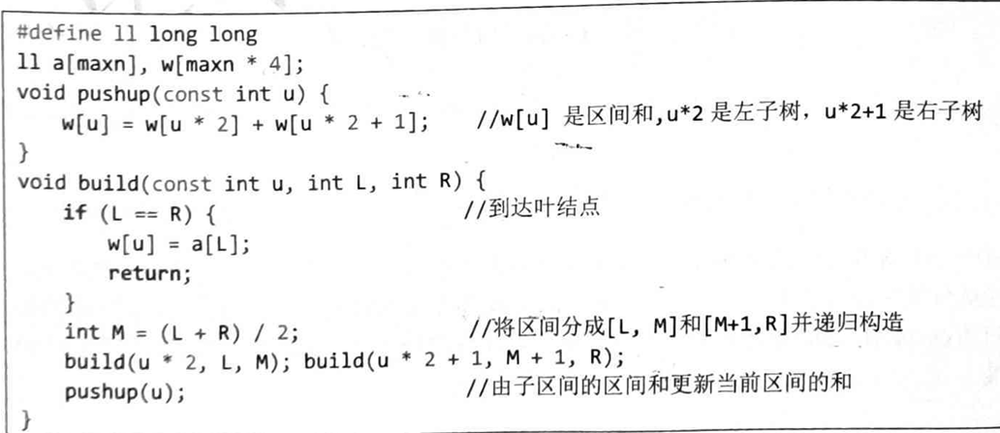
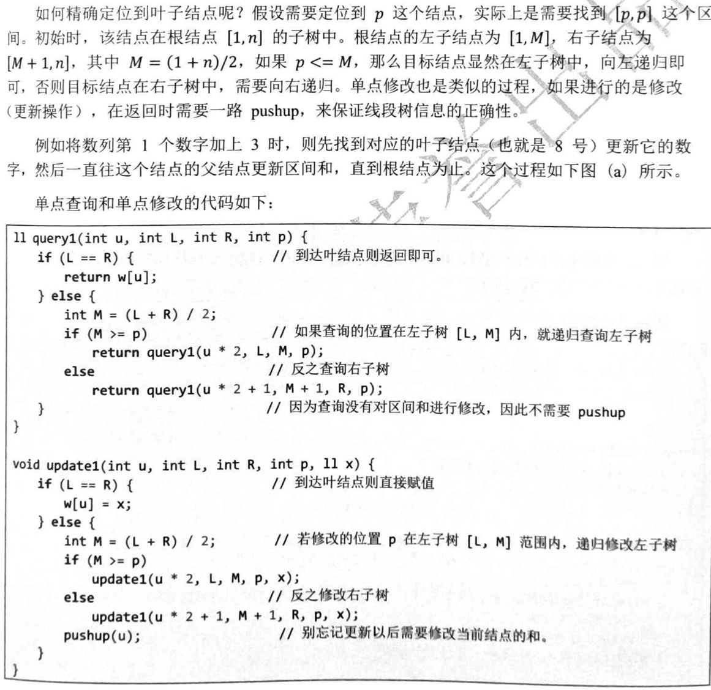
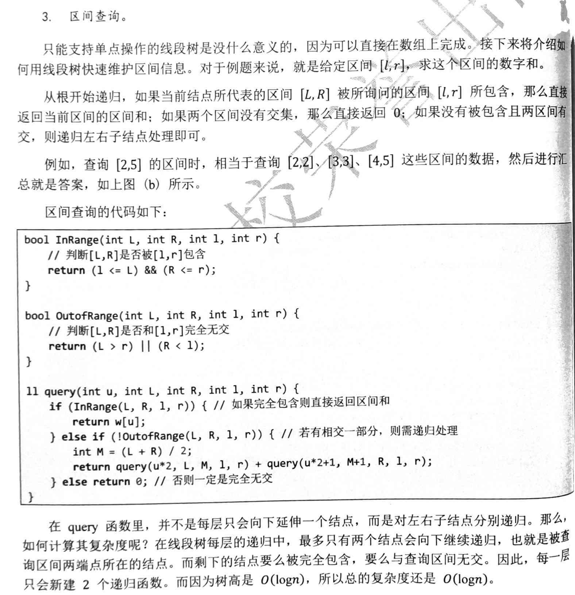

# 定义：
线段树是一棵二叉搜索树，与区间树相似，它将一个区间划分成一些单元区间，每个单元区间对应线段树中的一个叶结点。

# 代码实现：
1. 建立树：

- 时间复杂度：O(n)
  
2. 单点修改：

- 时间复杂度：O(logn)

3. 区间查询：

- 时间复杂度：O(logn)
- **为什么线段树区间查询，query中如果完全包含则直接返回?**:
 因为线段树从根节点开始递归，所以如果完全包含，那么这个节点的子节点也一定完全包含。
 eg:
 ```plaintext
                 [1-5]:15
                /       \
           [1-3]:8      [4-5]:7
           /    \       /    \
       [1-2]:4  [3]:4 [4]:5  [5]:2
       /    \
    [1]:3   [2]:1
 ```

现在，我们要查询区间 [2, 5] 的和：

1. 调用 query(1, 1, 5, 2, 5) ，检查根节点 [1-5]
   
   - [1-5] 不完全被 [2-5] 包含，但有交集
   - 分裂为左子树 [1-3] 和右子树 [4-5]
2. 对左子树：调用 query(2, 1, 3, 2, 5)
   
   - [1-3] 不完全被 [2-5] 包含，但有交集
   - 分裂为 [1-2] 和 [3]
3. 对 [1-2]：调用 query(4, 1, 2, 2, 5)
   
   - [1-2] 不完全被 [2-5] 包含，但有交集
   - 分裂为 [1] 和 [2]
4. 对 [1]：调用 query(8, 1, 1, 2, 5)
   
   - [1] 与 [2-5] 无交集，返回 0
5. 对 [2]：调用 query(9, 2, 2, 2, 5)
   
   - [2] 完全被 [2-5] 包含， 直接返回 w[9]=1
6. 对 [3]：调用 query(5, 3, 3, 2, 5)
   
   - [3] 完全被 [2-5] 包含， 直接返回 w[5]=4
7. 对右子树：调用 query(3, 4, 5, 2, 5)
   
   - [4-5] 完全被 [2-5] 包含， 直接返回 w[3]=7
8. 最终结果：0 + 1 + 4 + 7 = 12