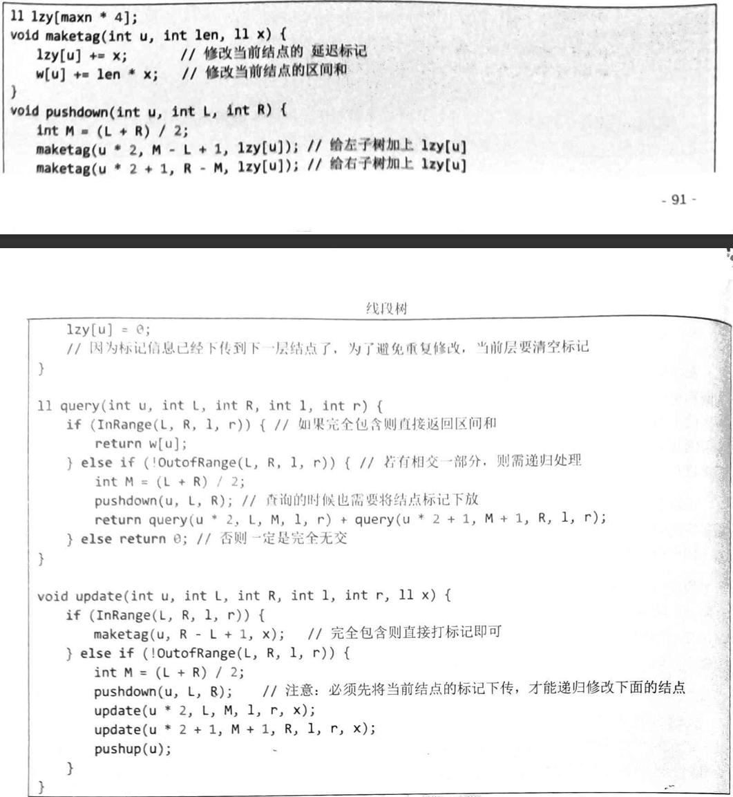

# 定义：
线段树是一棵二叉搜索树，与区间树相似，它将一个区间划分成一些单元区间，每个单元区间对应线段树中的一个叶结点。

# 代码实现：
1. 建立树：

- 时间复杂度：O(n)
```py
# 线段树数组
tree = []
# 懒标记数组
lazy = []
# 原始数组
arr = []

def build(p, l, r):
    """
    构建线段树
    p: 当前节点在tree中的下标
    l, r: 当前节点表示的区间范围
    """
    if l == r:
        tree[p] = arr[l]
        return
    
    mid = (l + r) // 2
    build(p * 2, l, mid)
    build(p * 2 + 1, mid + 1, r)
    tree[p] = tree[p * 2] + tree[p * 2 + 1]  # 区间和

```
2. 单点修改：

- 时间复杂度：O(logn)
```py
def update(p, l, r, idx, val):
    """
    单点更新
    p: 当前节点在tree中的下标
    l, r: 当前节点表示的区间范围
    idx: 要更新的位置
    val: 新的值
    """
    if l == r:
        tree[p] = val
        arr[idx] = val
        return
    
    mid = (l + r) // 2
    if idx <= mid:
        update(p * 2, l, mid, idx, val)
    else:
        update(p * 2 + 1, mid + 1, r, idx, val)
    tree[p] = tree[p * 2] + tree[p * 2 + 1]
```
3. 区间查询：

- 时间复杂度：O(logn)
- **为什么线段树区间查询，query中如果完全包含则直接返回?**:
 因为线段树从根节点开始递归，所以如果完全包含，那么这个节点的子节点也一定完全包含。
      eg:
   ```plaintext
                  [1-5]:15
                  /       \
            [1-3]:8      [4-5]:7
            /    \       /    \
         [1-2]:4  [3]:4 [4]:5  [5]:2
         /    \
      [1]:3   [2]:1
   ```

      现在，我们要查询区间 [2, 5] 的和：

      1. 调用 query(1, 1, 5, 2, 5) ，检查根节点 [1-5]
         
         - [1-5] 不完全被 [2-5] 包含，但有交集
         - 分裂为左子树 [1-3] 和右子树 [4-5]
      2. 对左子树：调用 query(2, 1, 3, 2, 5)
         
         - [1-3] 不完全被 [2-5] 包含，但有交集
         - 分裂为 [1-2] 和 [3]
      3. 对 [1-2]：调用 query(4, 1, 2, 2, 5)
         
         - [1-2] 不完全被 [2-5] 包含，但有交集
         - 分裂为 [1] 和 [2]
      4. 对 [1]：调用 query(8, 1, 1, 2, 5)
         
         - [1] 与 [2-5] 无交集，返回 0
      5. 对 [2]：调用 query(9, 2, 2, 2, 5)
         
         - [2] 完全被 [2-5] 包含， 直接返回 w[9]=1
      6. 对 [3]：调用 query(5, 3, 3, 2, 5)
         
         - [3] 完全被 [2-5] 包含， 直接返回 w[5]=4
      7. 对右子树：调用 query(3, 4, 5, 2, 5)
         
         - [4-5] 完全被 [2-5] 包含， 直接返回 w[3]=7
      8. 最终结果：0 + 1 + 4 + 7 = 12
```py
def query(p, l, r, ql, qr):
    """
    区间查询
    p: 当前节点在tree中的下标
    l, r: 当前节点表示的区间范围
    ql, qr: 查询的区间范围
    """
    # 当前区间完全在查询区间内
    if ql <= l and r <= qr:
        return tree[p]
    
    # 当前区间与查询区间无交集
    if qr < l or ql > r:
        return 0  # 区间和的默认值
    
    # 下传懒标记
    push_down(p, l, r)
    
    mid = (l + r) // 2
    return query(p * 2, l, mid, ql, qr) + query(p * 2 + 1, mid + 1, r, ql, qr)
```
4. 区间修改：

- 时间复杂度：O(logn)
```py
def push_down ( p , l , r ) :

"""

下传懒标记

p: 当前节点在tree中的下标

l, r: 当前节点表示的区间范围

"""

if lazy [ p ] != 0 :

mid = ( l + r ) // 2

# 更新左右子节点的值

tree [ p * 2 ] += lazy [ p ] * ( mid - l + 1 )

tree [ p * 2 + 1 ] += lazy [ p ] * ( r - mid )

# 传递懒标记

lazy [ p * 2 ] += lazy [ p ]

lazy [ p * 2 + 1 ] += lazy [ p ]

# 清除当前节点的懒标记

lazy [ p ] = 0

def update_range ( p , l , r , ul , ur , val ) :

"""

区间修改

p: 当前节点在tree中的下标

l, r: 当前节点表示的区间范围

ul, ur: 要更新的区间范围

val: 增加的值

"""

# 当前区间完全在更新区间内

if ul <= l and r <= ur:

tree [ p ] += val * ( r - l + 1 ) # 更新当前节

点的值

if l != r: # 非叶子节点，添加懒标记

lazy [ p ] += val

return

# 当前区间与更新区间无交集

if ur < l or ul > r:

return

# 下传懒标记

push_down ( p, l, r )

mid = ( l + r ) // 2

update_range ( p * 2 , l, mid, ul, ur, val )

update_range ( p * 2 + 1 , mid + 1 , r, ul, ur,

val )

tree [ p ] = tree [ p * 2 ] + tree [ p * 2 + 1 ] # 更

新当前节点的值
```

### 整体：
```py
# 线段树数组
tree = []
# 懒标记数组
lazy = []
# 原始数组
arr = []

def build(p, l, r):
    """
    构建线段树
    p: 当前节点在tree中的下标
    l, r: 当前节点表示的区间范围
    """
    if l == r:
        tree[p] = arr[l]
        return
    
    mid = (l + r) // 2
    build(p * 2, l, mid)
    build(p * 2 + 1, mid + 1, r)
    tree[p] = tree[p * 2] + tree[p * 2 + 1]  # 区间和

def push_down(p, l, r):
    """
    下传懒标记
    p: 当前节点在tree中的下标
    l, r: 当前节点表示的区间范围
    """
    if lazy[p] != 0:
        mid = (l + r) // 2
        # 更新左右子节点的值
        tree[p * 2] += lazy[p] * (mid - l + 1)
        tree[p * 2 + 1] += lazy[p] * (r - mid)
        # 传递懒标记
        lazy[p * 2] += lazy[p]
        lazy[p * 2 + 1] += lazy[p]
        # 清除当前节点的懒标记
        lazy[p] = 0

def update_range(p, l, r, ul, ur, val):
    """
    区间修改
    p: 当前节点在tree中的下标
    l, r: 当前节点表示的区间范围
    ul, ur: 要更新的区间范围
    val: 增加的值
    """
    # 递归终止条件
    # 当前区间完全在更新区间内
    if ul <= l and r <= ur:
        tree[p] += val * (r - l + 1)  # 更新当前节点的值
        if l != r:  # 非叶子节点，添加懒标记
            lazy[p] += val
        return
    
    # 当前区间与更新区间无交集
    if ur < l or ul > r:
        return
    
    # 下传懒标记
    push_down(p, l, r)
    
    mid = (l + r) // 2
    update_range(p * 2, l, mid, ul, ur, val)
    update_range(p * 2 + 1, mid + 1, r, ul, ur, val)
    tree[p] = tree[p * 2] + tree[p * 2 + 1]  # 更新当前节点的值

def query(p, l, r, ql, qr):
    """
    区间查询
    p: 当前节点在tree中的下标
    l, r: 当前节点表示的区间范围
    ql, qr: 查询的区间范围
    """
    # 当前区间完全在查询区间内
    if ql <= l and r <= qr:
        return tree[p]
    
    # 当前区间与查询区间无交集
    if qr < l or ql > r:
        return 0  # 区间和的默认值
    
    # 下传懒标记
    push_down(p, l, r)
    
    mid = (l + r) // 2
    return query(p * 2, l, mid, ql, qr) + query(p * 2 + 1, mid + 1, r, ql, qr)

# 使用示例
def solve():
    global arr, tree, lazy
    # 输入数组
    arr = [0, 1, 3, 5, 7, 9]  # 下标从1开始，0位置不用
    n = len(arr) - 1
    
    # 初始化线段树数组和懒标记数组，大小为4n足够
    tree = [0] * (4 * n + 10)
    lazy = [0] * (4 * n + 10)
    
    # 建树
    build(1, 1, n)
    
    # 查询区间[1,3]的和
    print(f"区间[1,3]的和: {query(1, 1, n, 1, 3)}")  # 输出：9 (1+3+5)
    
    # 区间修改：将区间[2,4]的每个元素都增加2
    update_range(1, 1, n, 2, 4, 2)
    
    # 再次查询
    print(f"更新后区间[1,3]的和: {query(1, 1, n, 1, 3)}")  # 输出：13 (1+(3+2)+(5+2))
    print(f"更新后区间[2,5]的和: {query(1, 1, n, 2, 5)}")  # 输出：27 ((3+2)+(5+2)+(7+2)+9)

solve()
```
### 懒标记作用：
---
疑惑？：
1.  区间查询：**为什么线段树区间查询，query中如果完全包含则直接返回?**（见区间查询）
2. 区间修改：**为什么要pushdown**
```py
例子场景:

假设我们有原始数组 arr = [1, 2, 3, 4, 5] （下标从 1 开始）。我们要进行以下操作：

区间修改: 将区间 [1, 3] 的所有元素都增加值 5。
区间查询: 查询区间 [2, 4] 的区间和。
初始状态:

同样，假设我们已经根据 arr 构建好了线段树和懒标记数组，初始懒标记都为 0。

原始数组 arr: [-, 1, 2, 3, 4, 5]
线段树 tree (简化表示关键节点):
tree[1] (区间 [1, 5]): 15 (1+2+3+4+5)
tree[2] (区间 [1, 3]): 6 (1+2+3)
tree[3] (区间 [4, 5]): 9 (4+5)
tree[4] (区间 [1, 2]): 3 (1+2)
tree[5] (区间 [3, 3]): 3 (3)
tree[6] (区间 [4, 4]): 4 (4)
tree[7] (区间 [5, 5]): 5 (5)
... （叶子节点值与 arr 对应）
懒标记数组 lazy: [0, 0, 0, 0, 0, 0, 0, ...]
操作 1: 区间修改 update_range(1, 1, 5, 1, 3, 5)

p = 1, l = 1, r = 5, ul = 1, ur = 3, val = 5
步骤拆解 (第一次区间修改):

进入 update_range(1, 1, 5, 1, 3, 5)

判断条件 1: ul <= l and r <= ur? 1 <= 1 and 5 <= 3 不成立。
判断条件 2: ur < l or ul > r? 3 < 1 or 1 > 5 不成立。
下传懒标记: push_down(1, 1, 5)
lazy[1] 为 0，push_down 无操作。
计算 mid = (1 + 5) // 2 = 3
递归调用 update_range(2, 1, 3, 1, 3, 5) (左子树)
进入 update_range(2, 1, 3, 1, 3, 5)

p = 2, l = 1, r = 3, ul = 1, ur = 3, val = 5
判断条件 1: ul <= l and r <= ur? 1 <= 1 and 3 <= 3 成立!
tree[2] += 5 * (3 - 1 + 1) = tree[2] + 15 = 6 + 15 = 21，更新 tree[2] 的值。
条件 l != r? 1 != 3 成立 (非叶子节点)。
lazy[2] += 5， 添加懒标记 lazy[2] = 5。
返回! (注意，这里因为完全覆盖，所以直接返回，不再继续递归)
返回到 update_range(1, 1, 5, 1, 3, 5)

递归调用 update_range(3, 4, 5, 1, 3, 5) (右子树)
进入 update_range(3, 4, 5, 1, 3, 5)

p = 3, l = 4, r = 5, ul = 1, ur = 3, val = 5
判断条件 1: ul <= l and r <= ur? 1 <= 4 and 5 <= 3 不成立。
判断条件 2: ur < l or ul > r? 3 < 4 or 1 > 5 成立! (无交集，ur < l 为真)
返回! (无交集，直接返回，右子树不需要更新)
返回到 update_range(1, 1, 5, 1, 3, 5)

左右子树递归调用完成。
更新 tree[1] 的值: tree[1] = tree[2] + tree[3] = 21 + 9 = 30，更新 tree[1] 的值。
返回!
第一次区间修改后的线段树状态 (关键节点):

tree[1] (区间 [1, 5]): 30
tree[2] (区间 [1, 3]): 21 (已更新)
tree[3] (区间 [4, 5]): 9 (未更新)
tree[4] (区间 [1, 2]): 3
tree[5] (区间 [3, 3]): 3
tree[6] (区间 [4, 4]): 4 ...
懒标记数组 lazy (关键变化):
lazy[2] = 5 (已添加懒标记)
其他 lazy 仍然为 0。
注意观察 lazy[2] 变为 5，tree[2] 的值也已更新。但 tree[4]，tree[5]  (作为 tree[2] 的子节点)  的值 尚未 因为懒标记而更新。 这就是懒标记的延迟更新效果。

操作 2: 区间查询 query(1, 1, 5, 2, 4)

p = 1, l = 1, r = 5, ql = 2, qr = 4
步骤拆解 (区间查询，触发懒标记下传):

进入 query(1, 1, 5, 2, 4)

判断条件 1: ql <= l and r <= qr? 2 <= 1 and 5 <= 4 不成立。
判断条件 2: qr < l or ql > r? 4 < 1 or 2 > 5 不成立。
下传懒标记: push_down(1, 1, 5)
lazy[1] 为 0，push_down 无操作。
计算 mid = (1 + 5) // 2 = 3
递归调用 query(2, 1, 3, 2, 4) (左子树)
进入 query(2, 1, 3, 2, 4)

p = 2, l = 1, r = 3, ql = 2, qr = 4

判断条件 1: ql <= l and r <= qr? 2 <= 1 and 3 <= 4  不成立。

判断条件 2: qr < l or ql > r? 4 < 1 or 2 > 3  不成立。

下传懒标记: push_down(2, 1, 3)

检查 lazy[2] 是否为 0? lazy[2] = 5， 非零! 需要下传懒标记!
mid = (1 + 3) // 2 = 2
更新左子节点 tree[4]: tree[4] += lazy[2] * (mid - l + 1) = tree[4] + 5 * (2 - 1 + 1) = tree[4] + 10 = 3 + 10 = 13，更新 tree[4] 的值。
更新右子节点 tree[5]: tree[5] += lazy[2] * (r - mid) = tree[5] + 5 * (3 - 2) = tree[5] + 5 = 3 + 5 = 8，更新 tree[5] 的值。
传递懒标记到左子节点 lazy[4]: lazy[4] += lazy[2] = lazy[4] + 5 = 0 + 5 = 5，传递懒标记 lazy[4] = 5。
传递懒标记到右子节点 lazy[5]: lazy[5] += lazy[2] = lazy[5] + 5 = 0 + 5 = 5，传递懒标记 lazy[5] = 5。
清除当前节点懒标记: lazy[2] = 0，清除 lazy[2]。
计算 mid = (1 + 3) // 2 = 2

递归调用 query(4, 1, 2, 2, 4) (左子树)

进入 query(4, 1, 2, 2, 4)

p = 4, l = 1, r = 2, ql = 2, qr = 4

判断条件 1: ql <= l and r <= qr? 2 <= 1 and 2 <= 4  不成立。

判断条件 2: qr < l or ql > r? 4 < 1 or 2 > 2  不成立。

下传懒标记: push_down(4, 1, 2)

检查 lazy[4] 是否为 0? lazy[4] = 5， 非零! 需要下传懒标记!
mid = (1 + 2) // 2 = 1
更新左子节点 tree[8]: tree[8] += lazy[4] * (mid - l + 1) = tree[8] + 5 * (1 - 1 + 1) = tree[8] + 5 = 0 + 5 = 5，更新 tree[8] 的值。
更新右子节点 tree[9]: tree[9] += lazy[4] * (r - mid) = tree[9] + 5 * (2 - 1) = tree[9] + 5 = 1 + 5 = 6，更新 tree[9] 的值。
传递懒标记到左子节点 lazy[8]: lazy[8] += lazy[4] = lazy[8] + 5 = 0 + 5 = 5，传递懒标记 lazy[8] = 5。
传递懒标记到右子节点 lazy[9]: lazy[9] += lazy[4] = lazy[9] + 5 = 0 + 5 = 0 + 5 = 5，传递懒标记 lazy[9] = 5。
清除当前节点懒标记: lazy[4] = 0，清除 lazy[4]。
计算 mid = (1 + 2) // 2 = 1

递归调用 query(8, 1, 1, 2, 4) (左子树)

进入 query(8, 1, 1, 2, 4)

p = 8, l = 1, r = 1, ql = 2, qr = 4
判断条件 1: ql <= l and r <= qr? 2 <= 1 and 1 <= 4 不成立。
判断条件 2: qr < l or ql > r? 4 < 1 or 2 > 1 成立! (无交集，ql > r 为真)
返回 0! (无交集，对区间和查询无贡献)
返回到 query(4, 1, 2, 2, 4)

递归调用 query(9, 2, 2, 2, 4) (右子树)
进入 query(9, 2, 2, 2, 4)

p = 9, l = 2, r = 2, ql = 2, qr = 4
判断条件 1: ql <= l and r <= qr? 2 <= 2 and 2 <= 4 成立!
返回 tree[9] = 6! (区间 [2, 2] 完全在查询区间 [2, 4] 内，返回节点值)
返回到 query(4, 1, 2, 2, 4)

左右子树递归调用完成。
返回 query(4, 1, 2, 2, 4) 的结果: query(8, 1, 1, 2, 4) + query(9, 2, 2, 2, 4) = 0 + 6 = 6
返回到 query(2, 1, 3, 2, 4)

递归调用 query(5, 3, 3, 2, 4) (右子树)
进入 query(5, 3, 3, 2, 4)

p = 5, l = 3, r = 3, ql = 2, qr = 4
判断条件 1: ql <= l and r <= qr? 2 <= 3 and 3 <= 4 成立!
返回 tree[5] = 8! (区间 [3, 3] 完全在查询区间 [2, 4] 内，返回节点值)
返回到 query(2, 1, 3, 2, 4)

左右子树递归调用完成。
返回 query(2, 1, 3, 2, 4) 的结果: query(4, 1, 2, 2, 4) + query(5, 3, 3, 2, 4) = 6 + 8 = 14
返回到 query(1, 1, 5, 2, 4)

递归调用 query(3, 4, 5, 2, 4) (右子树)
进入 query(3, 4, 5, 2, 4)

p = 3, l = 4, r = 5, ql = 2, qr = 4
判断条件 1: ql <= l and r <= qr? 2 <= 4 and 5 <= 4 不成立。
判断条件 2: qr < l or ql > r? 4 < 4 or 2 > 5 成立! (无交集，ql > r 为真)
返回 0! (无交集，对区间和查询无贡献)
返回到 query(1, 1, 5, 2, 4)

左右子树递归调用完成。
返回 query(1, 1, 5, 2, 4) 的结果: query(2, 1, 3, 2, 4) + query(3, 4, 5, 2, 4) = 14 + 0 = 14
最终查询结果: query(1, 1, 5, 2, 4) 返回 14。

关键的线段树和懒标记状态变化 (查询过程中):

在 query(2, 1, 3, 2, 4) 中，push_down(2, 1, 3) 被调用， 懒标记 lazy[2] = 5 被下传:
tree[4] 从 3 更新为 13
tree[5] 从 3 更新为 8
lazy[4] 从 0 更新为 5
lazy[5] 从 0 更新为 5
lazy[2] 从 5 清零为 0
在 query(4, 1, 2, 2, 4) 中，push_down(4, 1, 2) 被调用， 懒标记 lazy[4] = 5 被下传:
tree[8] 从 0 更新为 5
tree[9] 从 1 更新为 6
lazy[8] 从 0 更新为 5
lazy[9] 从 0 更新为 5
lazy[4] 从 5 清零为 0
```
3. 区间修改：**为什么最后要tree[u]=tree[u*2]+tree[u*2=1]**
```py
例子场景:

假设我们有原始数组 arr = [0, 1, 3, 5, 7, 9] (下标从 1 开始)。我们要对区间 [2, 4] 的所有元素都增加值 2。

初始状态:

首先，假设我们已经根据 arr 构建好了线段树和懒标记数组。为了简化演示，我们先假设已经构建好，并且初始懒标记都为 0。

原始数组 arr: [-, 0, 1, 3, 5, 7, 9] (下标 0 位置不用)
线段树 tree (简化表示，只展示部分节点的值，以及每个节点代表的区间):
tree[1] (区间 [1, 5]): 25 (1+3+5+7+9)
tree[2] (区间 [1, 3]): 9 (1+3+5)
tree[3] (区间 [4, 5]): 16 (7+9)
tree[4] (区间 [1, 2]): 4 (1+3)
tree[5] (区间 [3, 3]): 5 (5)
tree[6] (区间 [4, 4]): 7 (7)
tree[7] (区间 [5, 5]): 9 (9)
... (叶子节点值与 arr 对应，其他节点值是区间和)
懒标记数组 lazy: [0, 0, 0, 0, 0, 0, 0, ...] (初始都为 0)
我们要执行的操作:  update_range(1, 1, 5, 2, 4, 2)

p = 1, l = 1, r = 5, ul = 2, ur = 4, val = 2
步骤拆解:

进入 update_range(1, 1, 5, 2, 4, 2)

判断条件 1: ul <= l and r <= ur? 2 <= 1 and 5 <= 4 不成立。
判断条件 2: ur < l or ul > r? 4 < 1 or 2 > 5 不成立。
下传懒标记: push_down(1, 1, 5)
检查 lazy[1] 是否为 0? lazy[1] 是 0。 push_down 函数 没有执行任何操作 (因为没有懒标记)。
计算 mid = (1 + 5) // 2 = 3
递归调用 update_range(2, 1, 3, 2, 4, 2) (处理左子树)
进入 update_range(2, 1, 3, 2, 4, 2)

p = 2, l = 1, r = 3, ul = 2, ur = 4, val = 2
判断条件 1: ul <= l and r <= ur? 2 <= 1 and 3 <= 4 不成立。
判断条件 2: ur < l or ul > r? 4 < 1 or 2 > 3 不成立。
下传懒标记: push_down(2, 1, 3)
检查 lazy[2] 是否为 0? lazy[2] 是 0。 push_down 函数 没有执行任何操作。
计算 mid = (1 + 3) // 2 = 2
递归调用 update_range(4, 1, 2, 2, 4, 2) (处理左子树)
进入 update_range(4, 1, 2, 2, 4, 2)

p = 4, l = 1, r = 2, ul = 2, ur = 4, val = 2
判断条件 1: ul <= l and r <= ur? 2 <= 1 and 2 <= 4 不成立。
判断条件 2: ur < l or ul > r? 4 < 1 or 2 > 2 不成立。
下传懒标记: push_down(4, 1, 2)
检查 lazy[4] 是否为 0? lazy[4] 是 0。 push_down 函数 没有执行任何操作。
计算 mid = (1 + 2) // 2 = 1
递归调用 update_range(8, 1, 1, 2, 4, 2) (处理左子树)
进入 update_range(8, 1, 1, 2, 4, 2)

p = 8, l = 1, r = 1, ul = 2, ur = 4, val = 2
判断条件 1: ul <= l and r <= ur? 2 <= 1 and 1 <= 4 不成立。
判断条件 2: ur < l or ul > r? 4 < 1 or 2 > 1 不成立。
下传懒标记: push_down(8, 1, 1)
叶子节点，没有子节点，push_down 函数 没有执行任何操作。
叶子节点，不再分割，返回。
返回到 update_range(4, 1, 2, 2, 4, 2)

递归调用 update_range(9, 2, 2, 2, 4, 2) (处理右子树)
进入 update_range(9, 2, 2, 2, 4, 2)

p = 9, l = 2, r = 2, ul = 2, ur = 4, val = 2
判断条件 1: ul <= l and r <= ur? 2 <= 2 and 2 <= 4 成立!
tree[9] += 2 * (2 - 2 + 1) = tree[9] + 2 = 3 + 2 = 5 (假设 tree[9] 原值为 3，对应 arr[2] = 3)，更新 tree[9] 的值。
if l != r? 2 != 2 不成立 (叶子节点)。 不添加懒标记。
返回!
返回到 update_range(4, 1, 2, 2, 4, 2)

左右子树递归调用完成。
更新 tree[4] 的值: tree[4] = tree[8] + tree[9] (假设 tree[8] 原值为 1，对应 arr[1] = 1) = 1 + 5 = 6， 更新 tree[4] 的值。
返回!
返回到 update_range(2, 1, 3, 2, 4, 2)

递归调用 update_range(5, 3, 3, 2, 4, 2) (处理右子树)
进入 update_range(5, 3, 3, 2, 4, 2)

p = 5, l = 3, r = 3, ul = 2, ur = 4, val = 2
判断条件 1: ul <= l and r <= ur? 2 <= 3 and 3 <= 4 成立!
tree[5] += 2 * (3 - 3 + 1) = tree[5] + 2 = 5 + 2 = 7 (假设 tree[5] 原值为 5，对应 arr[3] = 5)， 更新 tree[5] 的值。
if l != r? 3 != 3 不成立 (叶子节点)。 不添加懒标记。
返回!
返回到 update_range(2, 1, 3, 2, 4, 2)

左右子树递归调用完成。
更新 tree[2] 的值: tree[2] = tree[4] + tree[5] = 6 + 7 = 13， 更新 tree[2] 的值。
返回!
返回到 update_range(1, 1, 5, 2, 4, 2)

递归调用 update_range(3, 4, 5, 2, 4, 2) (处理右子树)
进入 update_range(3, 4, 5, 2, 4, 2)

p = 3, l = 4, r = 5, ul = 2, ur = 4, val = 2
判断条件 1: ul <= l and r <= ur? 2 <= 4 and 5 <= 4 不成立。
判断条件 2: ur < l or ul > r? 4 < 4 or 2 > 5 不成立。
下传懒标记: push_down(3, 4, 5)
检查 lazy[3] 是否为 0? lazy[3] 是 0。 push_down 函数 没有执行任何操作。
计算 mid = (4 + 5) // 2 = 4
递归调用 update_range(6, 4, 4, 2, 4, 2) (处理左子树)
进入 update_range(6, 4, 4, 2, 4, 2)

p = 6, l = 4, r = 4, ul = 2, ur = 4, val = 2
判断条件 1: ul <= l and r <= ur? 2 <= 4 and 4 <= 4 成立!
tree[6] += 2 * (4 - 4 + 1) = tree[6] + 2 = 7 + 2 = 9 (假设 tree[6] 原值为 7，对应 arr[4] = 7)， 更新 tree[6] 的值。
if l != r? 4 != 4 不成立 (叶子节点)。 不添加懒标记。
返回!
返回到 update_range(3, 4, 5, 2, 4, 2)

递归调用 update_range(7, 5, 5, 2, 4, 2) (处理右子树)
进入 update_range(7, 5, 5, 2, 4, 2)

p = 7, l = 5, r = 5, ul = 2, ur = 4, val = 2
判断条件 1: ul <= l and r <= ur? 2 <= 5 and 5 <= 4 不成立。
判断条件 2: ur < l or ul > r? 4 < 5 or 2 > 5 不成立。
下传懒标记: push_down(7, 5, 5)
叶子节点，没有子节点，push_down 函数 没有执行任何操作。
叶子节点，不再分割，返回。
返回到 update_range(3, 4, 5, 2, 4, 2)

左右子树递归调用完成。
更新 tree[3] 的值: tree[3] = tree[6] + tree[7] (假设 tree[7] 原值为 9，对应 arr[5] = 9) = 9 + 9 = 18， 更新 tree[3] 的值。
返回!
返回到 update_range(1, 1, 5, 2, 4, 2)

左右子树递归调用完成。
更新 tree[1] 的值: tree[1] = tree[2] + tree[3] = 13 + 18 = 31， 更新 tree[1] 的值。
返回!
更新后的线段树 (简化表示):

tree[1] (区间 [1, 5]): 31 (更新后的区间和)
tree[2] (区间 [1, 3]): 13 (更新后的区间和)
tree[3] (区间 [4, 5]): 18 (更新后的区间和)
tree[4] (区间 [1, 2]): 6 (更新后的区间和)
tree[5] (区间 [3, 3]): 7 (更新后的值, 对应 arr[3] 更新后)
tree[6] (区间 [4, 4]): 9 (更新后的值, 对应 arr[4] 更新后)
tree[7] (区间 [5, 5]): 9 (未更新)
tree[9] (区间 [2, 2]): 5 (更新后的值, 对应 arr[2] 更新后)
tree[8] (区间 [1, 1]): 1 (未更新)
tree[6] (区间 [4, 4]): 9 (更新后的值, 对应 arr[4] 更新后)
tree[7] (区间 [5, 5]): 9 (未更新)
懒标记数组 lazy:  [0, 0, 0, 0, 0, 0, 0, ...]  懒标记数组在此例中仍然为全 0, 因为在 update_range 的过程中，没有遇到需要添加懒标记的情况 (因为更新区间 [2, 4] 没有完全覆盖任何非叶子节点代表的区间)。
```