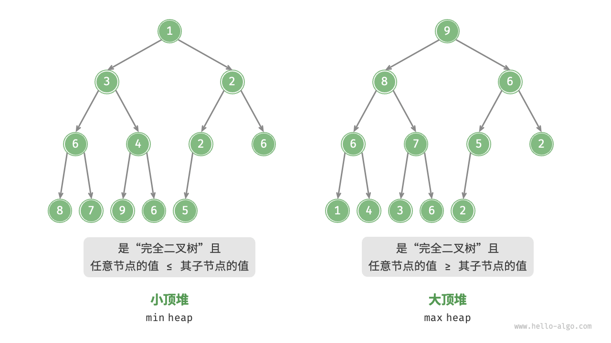

# 定义:

堆作为完全二叉树的一个特例，具有以下特性。
- 最底层节点靠左填充，其他层的节点都被填满。
- 我们将二叉树的根节点称为“堆顶”，将底层最靠右的节点称为“堆底”。
- 对于大顶堆（小顶堆），堆顶元素（根节点）的值是最大（最小）的。
 **堆通常用于实现优先队列，大顶堆相当于元素按从大到小的顺序出队的优先队列。从使用角度来看，我们可以将“优先队列”和“堆”看作等价的数据结构。** 

# 建立堆：
类似于排序算法中的“从小到大排列”和“从大到小排列”，我们可以通过设置一个 flag 或修改 Comparator 实现“小顶堆”与“大顶堆”之间的转换。代码如下所示：
```py
# 初始化小顶堆
min_heap, flag = [], 1
# 初始化大顶堆
max_heap, flag = [], -1

# Python 的 heapq 模块默认实现小顶堆
# 考虑将“元素取负”后再入堆，这样就可以将大小关系颠倒，从而实现大顶堆
# 在本示例中，flag = 1 时对应小顶堆，flag = -1 时对应大顶堆

# 元素入堆
heapq.heappush(max_heap, flag * 1)
heapq.heappush(max_heap, flag * 3)
heapq.heappush(max_heap, flag * 2)
heapq.heappush(max_heap, flag * 5)
heapq.heappush(max_heap, flag * 4)

# 获取堆顶元素
peek: int = flag * max_heap[0] # 5

# 堆顶元素出堆
# 出堆元素会形成一个从大到小的序列
val = flag * heapq.heappop(max_heap) # 5
val = flag * heapq.heappop(max_heap) # 4
val = flag * heapq.heappop(max_heap) # 3
val = flag * heapq.heappop(max_heap) # 2
val = flag * heapq.heappop(max_heap) # 1

# 获取堆大小
size: int = len(max_heap)

# 判断堆是否为空
is_empty: bool = not max_heap

# 输入列表并建堆
min_heap: list[int] = [1, 3, 2, 5, 4]
heapq.heapify(min_heap)
```

# 堆的底层实现：
“二叉树”章节讲过，完全二叉树非常适合用数组来表示。由于堆正是一种完全二叉树，因此我们将采用数组来存储堆。

当使用数组表示二叉树时，元素代表节点值，索引代表节点在二叉树中的位置。节点指针通过索引映射公式来实现。


- 入堆，出堆复杂度为O(logn)
见[hello-algo](https://www.hello-algo.com/chapter_heap/heap/#2)